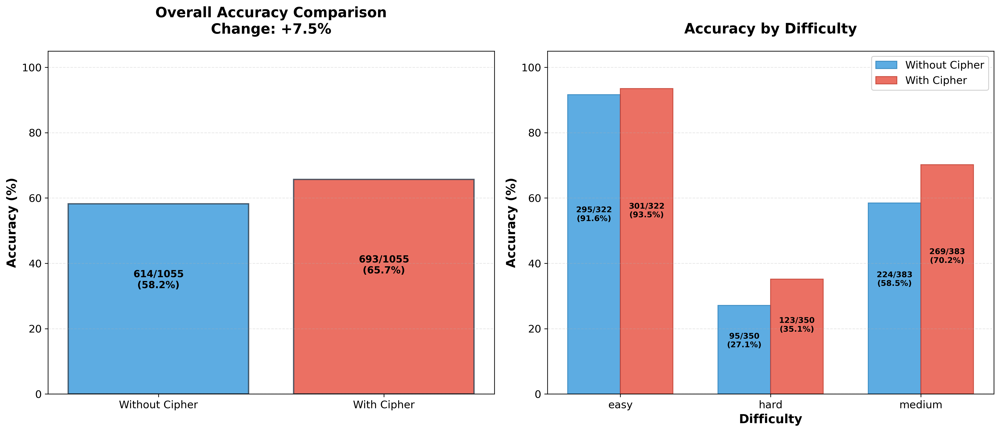
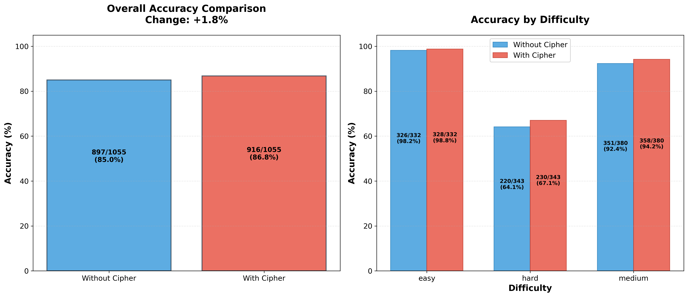
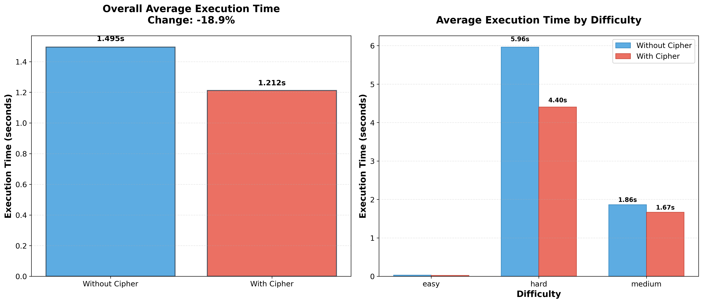
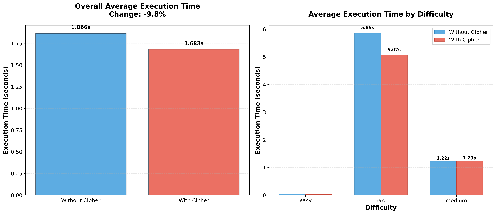
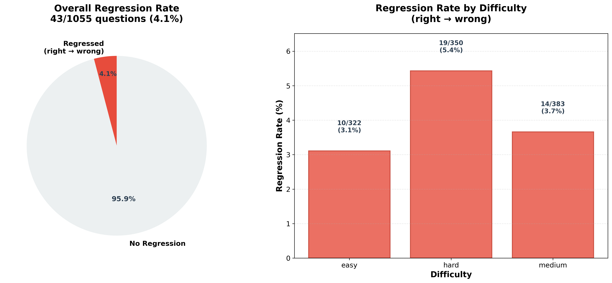
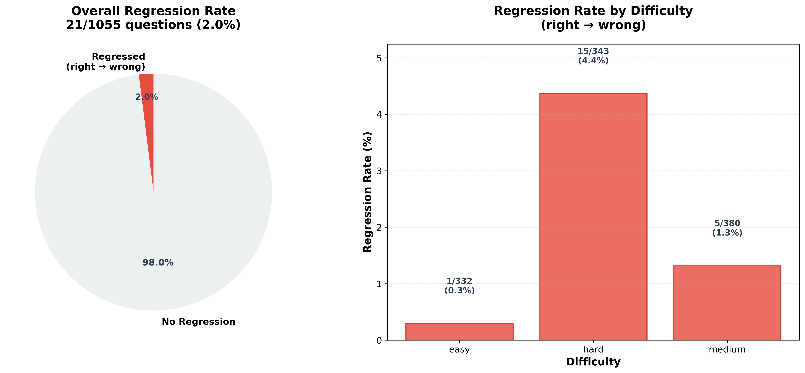
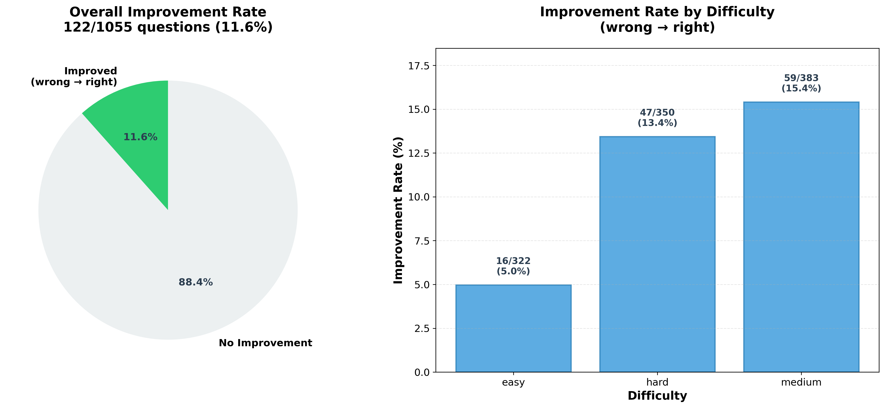
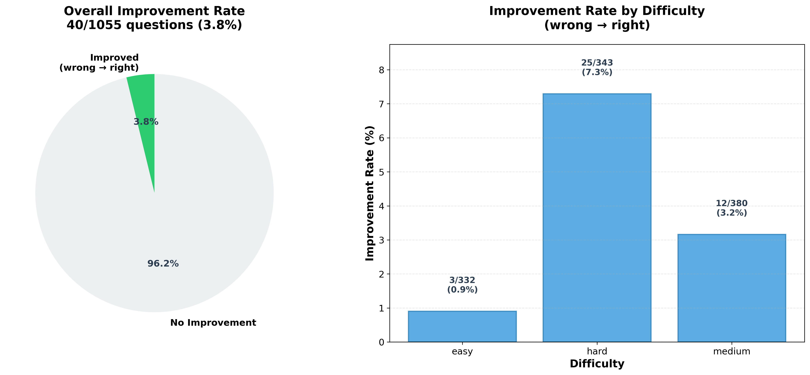

## Benchmark Report: Cipher Memory on LiveCodeBench

### 1. Abstraction
Large Language Models (LLMs) are typically stateless and constrained by training cutoffs. A memory layer enables continual learning by allowing models to evolve their knowledge with experience. Cipher provides such a memory layer: it stores structured, retrieval-ready reflections so models can learn from mistakes and reinforce good practices without expensive fine-tuning or exposing ground-truth answers.
Try out Cipher here: [Cipher](https://github.com/campfirein/cipher)
This experiment is carried out by Byterover team. More from Byterover here: [Byterover](https://www.byterover.dev/)
### 2. Benchmark setup
- **Models**: GPT-5-Nano and Gemini-2.5-Pro
- **Framework**: LiveCodeBench with Cipher memory workflow (see `LiveCodeBench/README.md` for setup and evaluation commands)
- **Scenario**: Code Generation with pass@k and execution-time analysis
- **Memory protocol**: Reflections are derived from each model’s own outputs with evaluation feedback (e.g., pass@1). We do not provide solutions; models introspect on their performance and store learnings for retrieval in subsequent runs.

### 3. Results
- **Accuracy improves with Cipher memory**:
  - GPT-5-Nano: 614/1055 (58.2%) → 693/1055 (65.7%) — **+7.5 points**
  - Gemini-2.5-Pro: 897/1055 (85.0%) → 916/1055 (86.8%) — **+1.8 points**

- **Execution time decreases (faster code with Cipher)**:
  - GPT-5-Nano: 1.4948s → 1.2120s — **−18.9%**
  - Gemini-2.5-Pro: 1.8656s → 1.6834s — **−9.8%**

- **By difficulty (highlights)**:
  - GPT-5-Nano accuracy: easy +1.9, medium +11.7, hard +8.0 points
  - Gemini accuracy: easy +0.6, medium +1.8, hard +2.9 points
  - GPT-5-Nano time: easy −19.9%, medium −10.5%, hard −26.1%
  - Gemini time: easy −18.1%, medium +0.6%, hard −13.4%

#### Visualizations (from `plots/`)
- **Accuracy — GPT-5-Nano**: Before vs After enabling Cipher with per-difficulty breakdown. Overall pass@1 rises from 58.2% to 65.7% (+7.5 points), with the largest gains in medium (+11.7) and hard (+8.0) tasks, indicating stronger generalization on challenging problems.
  - 

- **Accuracy — Gemini-2.5-Pro**: Modest but consistent improvement from 85.0% to 86.8% (+1.8 points). Gains are present across difficulties (easy +0.6, medium +1.8, hard +2.9), showing benefit even at a higher baseline.
  - 

- **Execution Time — GPT-5-Nano**: Average runtime drops 18.9% (1.49s → 1.21s). The biggest reduction is on hard problems (−26.1%), suggesting the retrieved reflections guide the model toward more efficient algorithmic choices on complex tasks.
  - 

- **Execution Time — Gemini-2.5-Pro**: Average runtime improves by 9.8% (1.87s → 1.68s). Easy (−18.1%) and hard (−13.4%) categories speed up, while medium shows a slight increase (+0.6%), indicating room for targeted reflection tuning on medium difficulty.
  - 

- **Regressions — GPT-5-Nano**: Right→Wrong cases total 4.1% (43/1055). By difficulty: easy 3.1%, medium 3.7%, hard 5.4%. This highlights occasional over-correction or overthinking after reflection on harder tasks.
  - 

- **Regressions — Gemini-2.5-Pro**: Right→Wrong is 2.0% (21/1055), with easy 0.3%, medium 1.3%, hard 4.4%. The lower regression rate suggests more stable reflection dynamics at a higher capability level.
  - 

- **Improvements — GPT-5-Nano**: Distribution concentrates on medium and hard tasks, aligning with the large pass@1 and runtime gains. The chart shows a net positive shift in outcomes after enabling Cipher.
  - 

- **Improvements — Gemini-2.5-Pro**: Improvements are smaller but broadly distributed across tasks, consistent with the model’s high baseline and the measured +1.8 point pass@1 increase.
  - 


### 4. Limitations
- **Right→Wrong regressions**: Despite overall gains, a small fraction of previously-correct answers become incorrect on the second try (GPT-5-Nano 4.1%, Gemini 2.0%), indicating a need to reduce hallucination or overthinking during reflection and retrieval.
- **Model coverage**: Only two frontier models were examined. Broader, more inclusive evaluations across model families, sizes, and domains are needed to generalize findings.

Overall, Cipher’s memory layer yields higher accuracy and faster execution for both models without providing answers or performing fine-tuning—demonstrating effective self-reflection–driven improvement.


### 5. Reproducibility: Benchmarks and Plots

#### Environment
```bash
cd path/to/benchmark/LiveCodeBench
python3 -m venv .venv && source .venv/bin/activate
pip install -e .
# If using Gemini-compatible setup
export GEMINI_API_KEY="<your_api_key>"
```

#### Run baseline (no memory)
```bash
# GPT-5-Nano baseline
python -m lcb_runner.runner.main \
  --model gpt-5-nano \
  --scenario codegeneration \
  --evaluate \
  --n 10 --temperature 0.2

# Gemini-2.5-Pro baseline
python -m lcb_runner.runner.main \
  --model gemini-2.5-pro \
  --scenario codegeneration \
  --evaluate \
  --n 10 --temperature 0.2
```

#### Build memory from baseline results
```bash
# Adjust --input_file to your actual baseline output path
# Example (GPT-5-Nano):
python build_reasoning.py \
  --input_file output/GPT-5-Nano/Scenario.codegeneration_1_0.2_eval_all.json \
  --model gemini-2.5-pro \
  --embedding_model gemini-embedding-001 \
  --collection_name memory

# Example (Gemini):
python build_reasoning.py \
  --input_file output/Gemini-2.5-Pro/Scenario.codegeneration_1_0.2_eval_all.json \
  --model gemini-2.5-pro \
  --embedding_model gemini-embedding-001 \
  --collection_name memory
```

#### Run with memory enabled
```bash
# GPT-5-Nano with Cipher memory
python -m lcb_runner.runner.main \
  --model gpt-5-nano \
  --scenario codegeneration \
  --evaluate \
  --use_memory \
  --n 10 --temperature 0.2

# Gemini-2.5-Pro with Cipher memory
python -m lcb_runner.runner.main \
  --model gemini-2.5-pro \
  --scenario codegeneration \
  --evaluate \
  --use_memory \
  --n 10 --temperature 0.2
```

Optional flags (performance/tuning): `--num_process_evaluate 8`, `--timeout 6`, `--use_cache`, `--continue_existing` (see `LiveCodeBench/README.md`).

#### Regenerate plots from benchmark JSONs
```bash
cd /path/to/cipher-benchmark-results
source venv/bin/activate

# GPT-5-Nano figures (uses data/gpt5_no_memory.json and data/gpt5_with_memory.json)
python analyze_results.py

# Gemini figures: update the input file names in analyze_results.py (lines loading JSON)
#   before_data = load_data('data/gemini_no_memory.json')
#   after_data  = load_data('data/gemini_with_memory.json')
# then rerun:
python analyze_results.py
```

Outputs are written to `plots/` (accuracy/execution/regression/improvement figures and summaries).

#### Additional LiveCodeBench visualizations
```bash
cd /path/to/cipher-benchmark-results/LiveCodeBench
python visualize.py  # generates plots/visualize_result.png and plots/difficulty_distribution_pie.png
```

